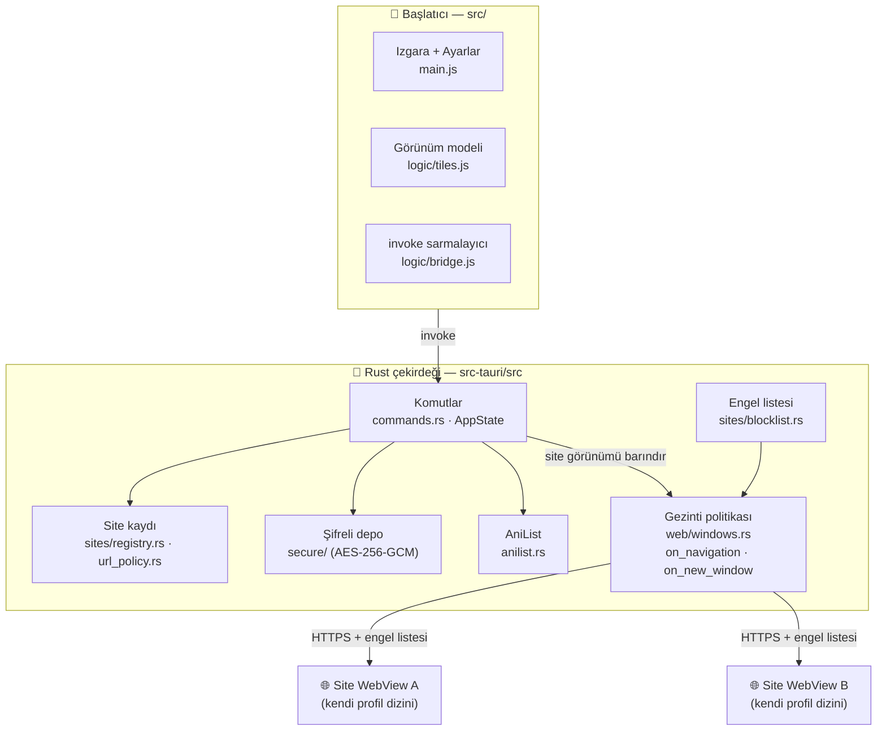

<div align="center">

<!-- Logo gömülü (base64): önizlemede de GitHub'da da ağ olmadan yüklenir.
     Yeniden üretmek için: scripts/build.sh icon -->

# AnimeHub

**Anime takip ve izleme sitelerini tek yerde toplayan; her siteyi kendi izole ve şifreli oturumunda açan Tauri 2 başlatıcısı.**

<br/>


[](https://github.com/mystery2430/Anime-Hub/releases/latest)
[](https://github.com/mystery2430/Anime-Hub/actions)
[](#lisans-ve-atıf)

</div>

---

## ℹ️&nbsp; Proje Hakkında

AnimeHub bir **başlatıcı**dır: tek bir siteye bağlanan bir istemci değil. Ekranda
gruplanmış bir ikon ızgarası görürsünüz, birine dokunursunuz, o site ana
pencerenin içinde kendi **izole** WebView'ında açılır (yeni pencere/sekme
yok; üstteki geri düğmesi veya `Esc` ile starters ekranına dönersiniz).
Siteler arasında çerez, localStorage veya oturum sızıntısı olmaz — MAL'da
giriş yapmanız AniList'i, AniList'te giriş yapmanız bir izleme sitesini
etkilemez.

İki grup vardır:

| Grup | İçerik |
|---|---|
| **Takip / Veritabanı** | MyAnimeList, AniList. AniList ayrıca uygulama içinden OAuth ile bağlanır |
| **İzleme** | OpenAnime, Animecix + sizin ekledikleriniz |

Uygulama `openani.me` gibi sitelerin içeriğini **barındırmaz, indirmaz veya
yeniden yayınlamaz**; yalnızca sizin seçtiğiniz adresi sistemin kendi WebView
motorunda açar. Sitelerin kullanım koşullarına uymak size aittir.

> [!NOTE]
> Bu proje bir topluluk çalışmasıdır; hiçbir sitenin resmî istemcisi değildir.

---

## 🏗️&nbsp; Mimari Genel Bakış

Tüm güvenlik politikası **Rust tarafında** uygulanır. Site WebView'ları hiçbir
Tauri komutuna erişemez; başlatıcı arayüzü ise yalnızca beyaz listelenmiş
komutları çağırabilir.



| Katman | Konum | Sorumluluk |
|---|---|---|
| **Rust çekirdeği** | `src-tauri/src/*.rs` | Komutlar, site kaydı, URL politikası, şifreli depo, AniList OAuth, site görünümünü barındırma |
| **Güvenlik katmanı** | `secure/`, `sites/`, `web/` | AES-256-GCM depo, HTTPS zorunluluğu, alan adı engelleme, gezinti/yeni pencere reddi |
| **Başlatıcı arayüzü** | `src/` | Izgara, site ekleme/düzenleme, Ayarlar ve Hakkında ekranları — `innerHTML` kullanmadan |
| **Android köprüsü** | `src-tauri/android-plugin/` | AndroidKeyStore (şifreleme) + Picture-in-Picture |
| **CI/CD** | `.github/workflows/` | Test matrisi, Android APK ve masaüstü paketlerinin otomatik derlenmesi |

---

## ⭐&nbsp; Öne Çıkan Özellikler

### 🪟&nbsp; Site başına izole oturum — tek pencerede

Her site kendi WebView profil dizinini alır:
`<uygulama verisi>/profiles/<site>`. Linux'ta WebKitGTK `data_directory`,
Windows'ta WebView2 profili kullanılır; çerezler, localStorage, IndexedDB ve
önbellek siteler arasında **hiç** kesişmez.

Masaüstünde site, uygulamanın **tek penceresi içinde** siteden-siteye
değişen bir alt WebView olarak barındırılır — tarayıcı sekmesi veya OS
penceresi yerine. Pencere başlığı site adını gösterir; "siteleri tam ekran
aç" **kapalı gelir** (varsayılan pencere boyutu), Ayarlar'dan açılabilir.
Ayrıca her site WebView'ının Tauri yetkisi **yoktur**: izinler yalnızca
başlatıcı WebView'ına kapsüllüdür, şüpheli bir site Rust komutlarına
ulaşamaz.

> [!IMPORTANT]
> Android'de sistem WebView'ının site başına profil API'si **yoktur**.
> Bunun yerine uygulama, site açılırken/kapanırken **tüm oturum verisini**
> şifreli blob'lara aktarır: çerez kavanozuna ek olarak `localStorage` ve
> IndexedDB de AndroidKeyStore ile mühürlenir, hedef sitenin sayfası
> yüklendiğinde geri yüklenir ve oturum açıkken 30 saniyede bir (depo
> blob'ları daha seyrek) tazelenir. IndexedDB aktarımı **en iyi çaba**
> ilkesiyle çalışır (belgeler ve anahtarlar taşınır; ikincil indeksler,
> key path ve Blob türü değerler korunmaz). Bu mekanizma henüz bir cihazda
> doğrulanmadı; doğrulama tamamlanana kadar ayrıştırma eksik kalırsa ekranda
> uyarı gösterilir.

### 🔒&nbsp; Diskte şifreli duran veriler

Oturum verileri ve API anahtarları AES-256-GCM ile şifrelenir (`AHB1` zarf
biçimi). Anahtar hiçbir zaman düz metin saklanmaz, platformun kendi anahtar
kaynağından gelir:

| Platform | Anahtar kaynağı |
|---|---|
| Windows | DPAPI (kullanıcı kapsamı) |
| Linux | XDG Secret Service (GNOME Anahtarlar / KWallet) |
| Android | AndroidKeyStore (donanım destekli) |
| Hiçbiri yoksa | `0600` izinli dosya — **ve Hakkında ekranında bu açıkça yazar** |

**Canlı oturum eşitlemesi:** site açıkken çerezler (Android'de ayrıca
localStorage/IndexedDB, daha seyrek aralıkla) 30 saniyede bir şifreli depoya
eşitlenir; kapanış anındaki export son ve yetkili yazım olarak kalır. Böylece
bir çökme ya da Android'in süreci öldürmesi en fazla bir aralıklik oturum
değişikliğini kaybettirir. Her arka plan yazımı, oturum sahipliği kontrolüyle
bir sitenin verisini asla başka bir sitenin blob'una yazamaz.

### 🛡️&nbsp; Sıkı gezinti politikası

- **Yalnızca HTTPS.** `http://` adresi reddedilir, downgrade denemeleri
  native `on_navigation` callback'inde engellenir.
- **Özel/ağ içi adresler reddedilir.** `127.0.0.1`, `10.x`, `192.168.x`,
  `169.254.x`, `::1`, link-local ve `.local` gibi hedeflere gidilemez — bir
  sitenin sizi yerel ağınıza yönlendirmesi engellenir.
- **Yeni pencere/sekme istekleri varsayılan olarak reddedilir**
  (`NewWindowResponse::Deny`).
- **Aynı özel adres kuralı gezinti sırasında da uygulanır.** Bir site sizi
  `https://192.168.1.1/` adresine yönlendirmeye çalışırsa kesilir; bu kural
  `tests/audit.rs` içinde regresyon testiyle kilitlidir.
- **DNS rebinding.** Herkese açık görünen bir ad, gezinti veya site açılışı
  anında özel bir adrese çözülüyorsa kesilir. Çözümleme eşzamanlı kalır
  (kısa zaman aşımı, `web/dns.rs`); zaman aşımında metin politikası geçerli
  kalır, DNS kesintisi siteleri kapatmaz. Sayfa yüklendikten sonra WebView'ın
  kendi çözümleyicisiyle yapılan alt istekler (XHR/`fetch`) bu kontrolden
  geçmez — onu kapatmak bir filtreleyen vekil ister ve v1'de yok.
- **Alan adı engel listesi** reklam ve izleyici alanlarını istek düzeyinde
  keser; liste koda gömülüdür ve güncellenebilir.

### ➕&nbsp; Kodsuz site ekleme

**Site ekle** ile ad + URL (+ isteğe bağlı harf/renk) girersiniz; site listesi
şifreli yapılandırma dosyasına yazılır. Düzenleme, **başlatıcıdan gizleme** ve
**çerezleri ve site verilerini temizleme** de aynı menüden yapılır — yeniden
derleme gerekmez.

Kullanıcı girişi render edilmeden önce doğrulanır: şema, özel adres kontrolü,
punycode normalizasyonu ve tekrar eden adres tespiti. Arayüz hiçbir yerde
`innerHTML` kullanmaz; tüm metin `textContent` ile yazılır. Bu, `npm test`
içindeki bir testle derlenmiş çıktı üzerinde de zorlanır.

### 👤&nbsp; AniList bağlantısı

AniList, OAuth 2.0 **authorization code** akışıyla bağlanır ve GraphQL
(`graphql.anilist.co`) üzerinden kitaplık + arama sorgular. `state` parametresi
UUID v4'tür ve sabit zamanlı karşılaştırma ile doğrulanır. Dönen token şifreli
depoya yazılır; `client_id` / `client_secret` sizindir, depoya asla girmez.

Bağlantı, Ayarlar → AniList bölümündeki **"AniList ile giriş yap"**
düğmesiyle başlar: OAuth ekranı sistem tarayıcınızda açılır, yetki
`animehub://auth` deep-link'i ile uygulamaya döner ve durum satırı
kendiliğinden güncellenir. Client ID kaydedilmediyse düğme pasif görünür ve
site kutucuğu siteyi WebView'da açmaya devam eder.

### 🎨&nbsp; Tema: sistem / koyu / açık

Üst çubuktaki üç düğmeli seçici (veya Ayarlar → Görünüm) ile tema anında
değişir. **Sistem** modu işletim sisteminin açık/koyu tercihini canlı takip
eder (`prefers-color-scheme`); koyu ve açık seçimleri hem arayüzü hem de
native pencere kromunu kaplar ve şifreli ayarlara kaydedilir.

> [!NOTE]
> AniList PKCE'yi belgelemediği için akış, client secret ile kuruludur.
> MyAnimeList v1'de **bilinçli olarak** atlandı: şimdilik düz bir başlatıcı
> kutucuğu olarak açılır.

### 📱&nbsp; Android Picture-in-Picture

Android 12+ (API 31) için Ayarlar'da **"PiP'e otomatik geç"** anahtarı vardır;
sistem PiP API'si (`PictureInPictureParams` + `setAutoEnterEnabled`)
kullanılır. Oran 16:9 varsayılandır ve Android'in kabul ettiği sınırlara
kırpılır.

---

## 📦&nbsp; Kurulum

Uygulama mağazalarda yayınlanmaz; doğrudan indirme ile dağıtılır.

### 🖥️&nbsp; Linux &nbsp;·&nbsp; `x86_64 — WebKitGTK 4.1`

| Yöntem | Boyut | Komut |
|---|---|---|
| **`.deb`** (Debian/Ubuntu) | ~3.1 MB | `sudo apt install ./AnimeHub_0.2.0_amd64.deb` |
| **`.rpm`** (Fedora/RHEL) | ~3.1 MB | `sudo rpm -ivh animehub-0.2.0-1.x86_64.rpm` |
| **AppImage** | ~75 MB | `chmod +x AnimeHub_*.AppImage && ./AnimeHub_*.AppImage` |

```bash
sudo apt install libwebkit2gtk-4.1-0 libgtk-3-0
```

### 🖥️&nbsp; Windows &nbsp;·&nbsp; `Windows 10/11 — x86_64`

| Yöntem | Boyut | Açıklama |
|---|---|---|
| **NSIS kurulum** | ~1.9 MB | Releases sayfasından `.exe` indir, çalıştır (`currentUser` modu, yönetici gerekmez) |

> [!NOTE]
> **Windows paketleri henüz kod imzalı değildir (0.2.0 dahil);** SmartScreen çıkarsa Ek bilgi → Yine de çalıştır. Kod imzalama altyapısı hazır — imzalı sürümler için sertifika bağlandığında (SignPath Foundation programı değerlendiriliyor / alternatifler: Certum OV, Microsoft Store) duyurulacak.

### 📱&nbsp; Android &nbsp;·&nbsp; `Android 8.0+ (API 26)`

| Yöntem | Boyut | Açıklama |
|---|---|---|
| **İmzalı APK** | ~7–11 MB | Releases sayfasından ABI'nize uygun `.apk` (`animehub-aarch64-release.apk` çoğu modern telefon; `animehub-armv7-release.apk` eski 32-bit; `animehub-x86_64-release.apk` emülatör) |

> [!NOTE]
> APK'lar tüm CI işlerinde derleniyor ve yayın anahtarıyla imzalanıyor.
> Henüz bir cihazda elle doğrulanmadı — sorun yaşarsanız Issue açın.

---

## 🖥️&nbsp; Platform Desteği

| Platform | Durum | Paketler | Notlar |
|---|---|---|---|
| 🐧 **Linux** | ✅ Doğrulandı | `.deb`, `.rpm`, AppImage | Releases sayfasındaki paketler CI sürümünde üretildi |
| 🪟 **Windows** | ✅ Doğrulandı | `.exe` (NSIS) | DPAPI + WebView2 profili; kurulum Windows üzerinde elle doğrulandı |
| 🤖 **Android** | ✅ Derleniyor | 3 ABI için imzalı `.apk` | Çerez + localStorage/IndexedDB şifreli blob aktarımıyla oturum ayrımı; cihaz testi bekleniyor |
| 🍎 **macOS** | ❌ Desteklenmiyor | — | Bilinçli kapsam dışı |
| 🍏 **iOS** | ❌ Desteklenmiyor | — | Bilinçli kapsam dışı |

---

## ⌨️&nbsp; Kontroller

| Girdi | İşlev |
|---|---|
| `Esc` | Açık iletişim kutusunu kapatır; hiçbiri yoksa başlatıcıya döner |
| Android geri tuşu | `Esc` ile aynı davranış |
| Site menüsü → **Düzenle** | Ad, adres, harf ve rengi değiştirir. Varsayılan olmayan sitelere fotoğraf eklenebilir |
| Site menüsü → **Başlatıcıdan gizle** | Siteyi listeden kaldırır, verisini silmez |
| Site menüsü → **Çerezleri ve site verilerini temizle** | O sitenin tüm oturum verisini yok eder |

---

## 🔧&nbsp; Kaynaktan Derleme

### 1. Ön gereksinimler

- [Rust](https://www.rust-lang.org/tools/install) — güncel stable önerilir
  (MSRV `1.77`, bkz. `src-tauri/Cargo.toml`)
- [Node.js](https://nodejs.org/) 20+
- Linux: `libwebkit2gtk-4.1-dev libgtk-3-dev librsvg2-dev`
- Android: SDK platform 36, NDK `29.0.13846066`, `ANDROID_HOME` ve `NDK_HOME` tanımlı
- Tümü için: [Tauri ön gereksinimleri](https://v2.tauri.app/start/prerequisites/)

### 2. Klonla & çalıştır

```bash
git clone https://github.com/mystery2430/Anime-Hub.git
cd Anime-Hub
npm install

npm run tauri dev      # native pencere + hot reload
npm run dev            # yalnızca arayüz kabuğu (native özellikler olmadan)
npm run check          # frontend + Rust testleri
```

### 3. Paketleme

```bash
./scripts/build.sh linux      # AppImage + .deb + .rpm
./scripts/build.sh windows    # NSIS .exe (Windows'ta)
./scripts/build.sh android    # imzalı .apk
./scripts/build.sh test       # tüm testler
./scripts/build.sh icon       # ikonları yeniden üret
```

> [!TIP]
> Dağıtım profilinde LTO açık; `gtk`/WebKit crate'leri bağlanırken **2 GB'dan
> fazla RAM** ister. Küçük bir makinede
> `TAURI_LOW_MEMORY=1 ./scripts/build.sh linux` bu iki ayarı yalnızca derleme
> süresince gevşetir ve çıkışta `Cargo.toml`'u geri yükler.

Android imzalaması için `src-tauri/gen/android/keystore.properties` dosyasını
`.env.example` içindeki şablona göre oluşturun. **Keystore'u asla commit
etmeyin** — `.gitignore` bunu zaten engeller.

---

## 🔄&nbsp; CI/CD

| İş akışı | Tetikleyici | Ne yapar |
|---|---|---|
| `ci.yml` | her push / PR | 3 işletim sisteminde test, `fmt`, `clippy -D warnings`, `cargo audit`, gizli anahtar taraması |
| `release-android.yml` | `v*` etiketi | 3 ABI için imzalı `.apk`, GitHub Release'e ekler |
| `release-desktop.yml` | `v*` etiketi | Linux `.deb`/`.rpm`/AppImage + Windows NSIS |

```bash
git tag vX.Y.Z          # sürüm etiketi; iki release iş akışını da tetikler
git push origin vX.Y.Z
```

Depoda **hiçbir gizli anahtar yoktur**. Android keystore'u
`secrets.ANDROID_KEYSTORE_BASE64` üzerinden geçici dosyaya yazılır ve
`if: always()` adımında `shred -u` ile silinir; AniList istemci bilgileri
kullanıcının kendi cihazında, şifreli depoda tutulur. Windows kod imzalama
da yalnızca GitHub secret'larına bağlıdır (`WINDOWS_CERTIFICATE` /
`WINDOWS_SIGN_CMD` + ilgili şifreler) — secret yoksa paketler imzasız
üretilir.

---

## 🗺️&nbsp; Yol Haritası

v1'e kadar bilinçli olarak dar tutuldu. Ertelenenler:

- [ ] MyAnimeList native entegrasyonu (v1'de yalnızca başlatıcı kutucuğu)
- [ ] Otomatik güncelleme kontrolü
- [ ] Yeni bölüm bildirimleri
- [ ] Yerel izleme geçmişi / "devam et" listesi
- [ ] Android'de tam oturum izolasyonu (localStorage/IndexedDB dahil)
- [ ] Windows kod imzalama (SignPath Foundation programı değerlendiriliyor — Certum OV / Microsoft Store alternatifleri açık)
- [ ] macOS desteği
- [ ] Her hangi bir programa dayanmayan cookie şifreleme

---

## ✅&nbsp; Doğrulama durumu

| Doğrulama | Sonuç |
|---|---|
| `npm test` | **65 test geçti**, 0 hata |
| `cargo test --all` / `clippy -- -D warnings` / `fmt --check` | GitHub Actions'ta yeşil — Tests işi `ubuntu-24.04`, `macos-latest` ve `windows-latest` üzerinde |
| `cargo build --release --locked` (LTO, tek codegen unit) | GitHub Actions "Release profile (LTO)" işinde geçti |
| `cargo audit` + gizli anahtar taraması | "Dependency and secret audit" işinde geçti |
| Android APK derlemesi (aarch64, armv7, x86_64) | yeşil — `release-android.yml` ve CI'daki Android compile işi; `cfg!()` yerine `#[cfg(desktop)]` / `#[cfg(mobile)]` derleme-zamanı sınırlarıyla |
| **v0.2.0 yayın paketleri** | doğrulandı: 3 **imzalı** APK + `AnimeHub_0.2.0_x64-setup.exe` + `.deb`/`.rpm`/AppImage; `main` CI'sı tam yeşil |
| Windows kurulumu | Windows üzerinde elle doğrulandı (DPAPI + WebView2 profili) |

**Hâlâ doğrulanmayanlar:**

- **Android cihaz testi.** APK derlenip imzalanıyor; elle cihaz doğrulaması
  yapılmadı (PiP, çerez takası, localStorage/IndexedDB şifreli aktarımı ve
  geri katmanı dahil). IndexedDB aktarımının kayıpsız olmadığı bilinir:
  ikincil indeksler ve Blob değerleri taşınmaz.
- **İmzalı Windows paketi.** Kod imzalama altyapısı CI'da hazır; SignPath
  sertifikası bağlandığında ilk imzalı sürümle doğrulanacak.

Tüm doğrulama kayıtları ve devralan kişiye düşen işler
[`HANDOFF.md`](./HANDOFF.md) dosyasında.

---

## 🤝&nbsp; Katkıda Bulunma

1. Değişiklikten önce [Issues](https://github.com/mystery2430/Anime-Hub/issues)
   listesine bakın.
2. `npm run check` yerelde yeşil olmalı (frontend + Rust testleri).
3. `cargo clippy --all-targets -- -D warnings` ve `cargo fmt --check` temiz
   olmalı — CI bunları zaten zorlar.
4. Güvenlik katmanına dokunan değişikliklerde `tests/security.test.js`
   içindeki varsayımları da güncelleyin.

---

## 📄&nbsp; Lisans ve atıf

**MIT.** Metin [`LICENSE`](./LICENSE) dosyasında.

Bu proje **temiz oda** (clean-room) bir uygulamadır: GPLv3 lisanslı
**Dantotsu**'dan **hiçbir kod taşınmamıştır**; yalnızca API yaklaşımı
referans alınmıştır. Bu ayrımın lisans sonuçları ve tüm atıflar
[`NOTICES.md`](./NOTICES.md) dosyasındadır.

Mimari deseni — "başlatıcı ekranı + seçilen siteyi uygulama içi WebView'da açma"
— [OpenAnime-Linux](https://github.com/tuanapi/OpenAnime-Linux) ve
[OpenAnime-Desktops](https://github.com/Dark-Hunter-TR/OpenAnime-Desktops)
projelerinden esinlenmiştir. Teknoloji seçimleri (Tauri 2 / Rust) bu
projelerden alınmamıştır.

---

<div align="center">

<sub>AnimeHub hiçbir siteyle bağlantılı değildir ve içerik barındırmaz.</sub>

</div>
